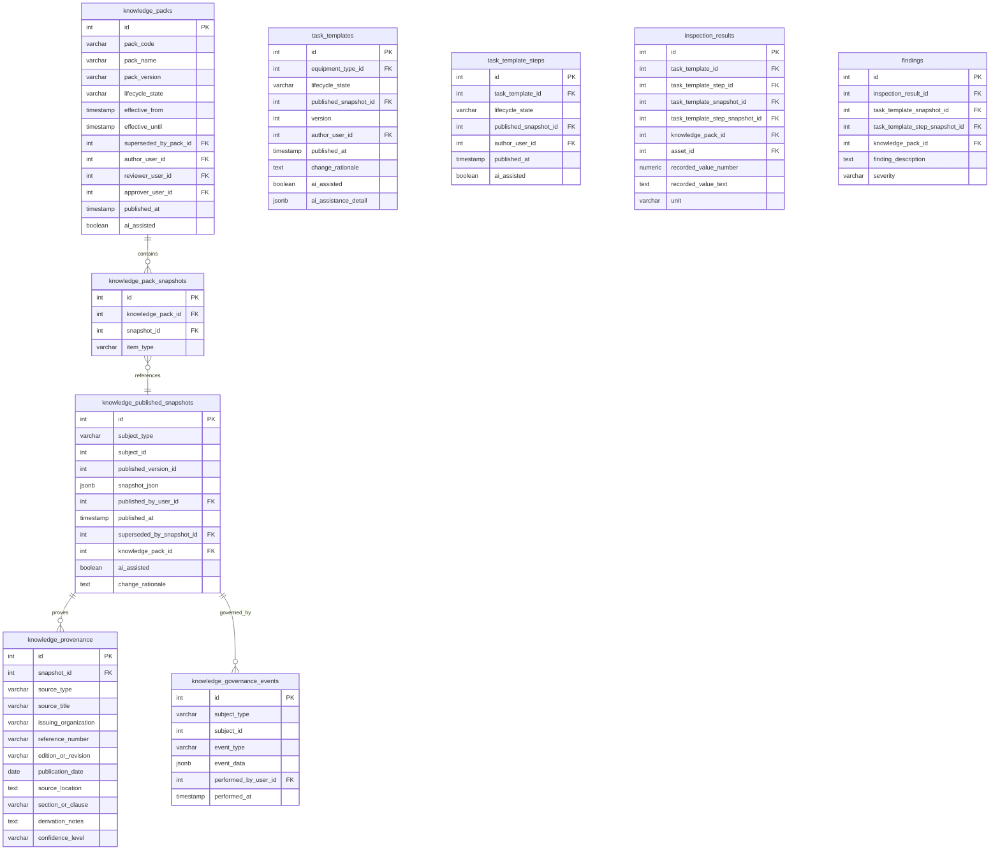

# ATM-013D — Atiman Knowledge Governance Schema Design

Repository: `estrangender26/ODM-CMMS`
Base: `main @ 31c9610`
Date: 2026-08-10
Status: Architecture/design only — no schema, code, or data changes.

> **Documentation status notice**
> - **Status:** Superseded and rejected design alternative; retained as decision history.
> - **Authority:** Not approved architecture. The snapshot/JSON publication model was rejected.
> - **Historical base:** `main @ 31c9610`.
> - **Reviewed against:** `main @ 34cae1fad779ff45220fd1783025e6cfc442b44f`.
> - **Superseded by:** ATM-013D2, which selected normalized immutable version tables.

## 1. Executive Summary

This document selects the smallest practical schema design that gives Atiman:

- immutable published knowledge,
- step-level evidence and traceability,
- controlled revision,
- historical reproducibility of executed inspections,
- and accountable human governance over AI-assisted content.

The chosen model is **Option C — immutable published snapshots plus editable working records** — applied specifically to `task_templates`, `task_template_steps`, and a new `knowledge_packs` structure. It avoids full row-versioning of every knowledge table while still satisfying every non-negotiable requirement from ATM-013C2.

## 2. Versioning Boundary Decision

### Options Considered

| Option | Description | Pros | Cons |
|--------|-------------|------|------|
| A. Independently version templates and steps | Each `task_templates` and `task_template_steps` row becomes a versioned entity with its own lifecycle. | Maximum flexibility; step-level governance. | Complex; many version chains; risk of orphaned step versions; harder to reason about “the template as approved.” |
| B. Immutable template version owns its complete step set | A `task_template_versions` row contains or references all steps for that version. | Clean historical identity; one version object per template. | Duplicates step rows on every template edit; harder to reuse steps; large storage growth. |
| C. Immutable published snapshot plus editable working records | Keep current `task_templates` and `task_template_steps` as **working records**. On publish, create an immutable snapshot in `knowledge_published_snapshots`. Operational executions reference the snapshot. | Smallest change; preserves existing tables and IDs; one snapshot per publish event; historical reproducibility guaranteed; efficient editing. | Slightly denormalized snapshot storage; requires snapshot generation on publish. |

### Selected Model: Option C

**Rationale:**
- The existing `task_templates` / `task_template_steps` schema is already adequate for authoring and review.
- The non-negotiable requirement is **historical reproducibility**, not independent step versioning.
- A snapshot model gives a single, immutable, auditable artifact per published template without multiplying tables.
- It is the smallest architecture that satisfies all constraints.

### Working Records vs. Published Snapshots

| Aspect | Working Records | Published Snapshots |
|--------|-----------------|---------------------|
| Tables | `task_templates`, `task_template_steps` | `knowledge_published_snapshots` |
| Mutability | Editable during drafting/review | Immutable after publish |
| Lifecycle | Draft → Under Review → Approved → Published | Created once when working record is published |
| Operational use | No — only authoring and review | Yes — schedules/inspections reference snapshots |
| Version chain | `version` integer incremented on publish | `published_version_id` sequence per template |
| Supersession | Working record’s `published_snapshot_id` points to latest; older snapshots remain | `superseded_by_snapshot_id` links newer snapshot |

## 3. Proposed Tables and Columns

### 3.1 New Table: `knowledge_packs`

A pack is a published collection of approved knowledge snapshots.

```
knowledge_packs
  id (PK, serial)
  pack_code (varchar, unique, stable)
  pack_name (varchar, not null)
  pack_version (varchar, semantic, not null)
  lifecycle_state (varchar: draft, under_review, approved, published, superseded, retired)
  effective_from (timestamp with time zone)
  effective_until (timestamp with time zone)
  superseded_by_pack_id (int, FK → knowledge_packs.id, nullable)
  author_user_id (int, FK → users.id, nullable)
  reviewer_user_id (int, FK → users.id, nullable)
  approver_user_id (int, FK → users.id, nullable)
  reviewed_at (timestamp with time zone)
  approved_at (timestamp with time zone)
  published_at (timestamp with time zone)
  next_review_at (timestamp with time zone)
  change_summary (text)
  ai_assisted (boolean, default false)
  ai_assistance_detail (jsonb)
  created_at (timestamp with time zone, default now())
  updated_at (timestamp with time zone, default now())
```

### 3.2 New Table: `knowledge_pack_snapshots`

Membership of a pack version: which immutable snapshots belong to it.

```
knowledge_pack_snapshots
  id (PK, serial)
  knowledge_pack_id (int, FK → knowledge_packs.id, not null)
  snapshot_id (int, FK → knowledge_published_snapshots.id, not null)
  item_type (varchar, not null)
    values: equipment_category, equipment_class, equipment_type,
            task_template, task_template_step, activity_code,
            cause_code, damage_code, failure_mode, object_part,
            maintainable_item, subunit, safety_control, acceptance_criterion
  added_at (timestamp with time zone, default now())
  UNIQUE(knowledge_pack_id, snapshot_id, item_type)
```

**Why polymorphic membership?** A pack is an aggregate of many entity types. A separate membership table per entity would be excessive. The `(item_type, snapshot_id)` pair references `knowledge_published_snapshots.id`, which carries its own `subject_type`, so referential integrity is preserved indirectly through the snapshot table.

### 3.3 New Table: `knowledge_published_snapshots`

The central immutable snapshot store.

```
knowledge_published_snapshots
  id (PK, serial)
  subject_type (varchar, not null)
    values: task_template, task_template_step, equipment_type,
            equipment_class, equipment_category, activity_code,
            cause_code, damage_code, failure_mode, object_part,
            maintainable_item, subunit, safety_control, acceptance_criterion
  subject_id (int, not null) — logical id of the working record
  published_version_id (int, not null) — per-subject version counter
  snapshot_json (jsonb, not null) — complete frozen representation
  published_by_user_id (int, FK → users.id, nullable)
  published_at (timestamp with time zone, default now())
  superseded_by_snapshot_id (int, FK → knowledge_published_snapshots.id, nullable)
  knowledge_pack_id (int, FK → knowledge_packs.id, not null)
  ai_assisted (boolean, default false)
  lifecycle_state_at_publish (varchar, default 'published')
  change_rationale (text)
  UNIQUE(subject_type, subject_id, published_version_id)
```

The `snapshot_json` contains the entire frozen working-record state at publish time, including all fields needed for execution and audit. It is the authoritative historical artifact.

### 3.4 New Table: `knowledge_provenance`

Structured many-to-many evidence relationships. One provenance record links to one snapshot.

```
knowledge_provenance
  id (PK, serial)
  snapshot_id (int, FK → knowledge_published_snapshots.id, not null)
  source_type (varchar, not null)
    values: manufacturer_manual, engineering_standard, internal_standard,
            regulatory_source, legacy_migration, engineering_authored,
            ai_assisted_draft, ai_reviewed, operator_feedback, field_evidence
  source_title (varchar)
  issuing_organization (varchar)
  reference_number (varchar)
  edition_or_revision (varchar)
  publication_date (date)
  effective_date (date)
  source_location (text) — URL, document ID, library path
  section_or_clause (varchar)
  page_or_paragraph (varchar)
  derivation_notes (text)
  confidence_level (varchar: established, provisional, experimental, uncertain)
  created_by_user_id (int, FK → users.id, nullable)
  created_at (timestamp with time zone, default now())
```

**Why snapshot-level provenance rather than working-record provenance?** Provenance must be frozen at publication. If provenance were tied to mutable working records, historical reproducibility would be lost. Tying provenance to `snapshot_id` makes the evidence chain immutable.

### 3.5 New Table: `knowledge_governance_events`

A single event stream replaces separate review/approval tables.

```
knowledge_governance_events
  id (PK, serial)
  subject_type (varchar, not null) — same enum as snapshots
  subject_id (int, not null) — logical id of working record
  event_type (varchar, not null)
    values: draft_created, submitted_for_review, review_approved, review_rejected,
            approved, published, superseded, retired, ai_assisted_flag_set,
            provenance_added, provenance_removed, change_rationale_updated
  event_data (jsonb) — payload: reviewer/approver IDs, comments, rationale, diffs
  performed_by_user_id (int, FK → users.id, nullable)
  performed_at (timestamp with time zone, default now())
```

**Why an event model instead of separate review/approval columns?** It captures the full audit trail, supports rejection/rework loops, and avoids adding many nullable columns to every knowledge table. The working record can still cache `lifecycle_state` for query convenience, but the event table is the authoritative history.

## 4. Changes to Existing Tables

### 4.1 `task_templates`

| Current | Problem | Proposed Change | Rationale |
|---------|---------|-----------------|-----------|
| `version` (int, default 1) | No immutable version artifact; operational records reference logical ID only | Keep `version` as the working draft counter; add `published_snapshot_id` (int, FK → knowledge_published_snapshots.id, nullable) | Points to the immutable snapshot that governs operational use |
| `is_system` (boolean) | Ambiguous vs. shared/tenant | Keep; `true` = shared Atiman knowledge, `false` = tenant working copy | Aligns with approved Atiman knowledge ownership model |
| `is_editable` (boolean) | Insufficient for governance | Keep for UX; actual editability determined by `lifecycle_state` | State machine is the governance source of truth |
| `task_kind` (varchar) | Legacy values only | Add CHECK or application enforcement for canonical families: `inspect`, `verify_safety`, `test_measure`, `lubricate`, `clean`, `adjust`, `replace` | Enforces canonical model |
| `maintenance_type` (varchar) | All legacy values are `preventive` | Add CHECK or application enforcement for: `preventive`, `predictive`, `condition_based`, `compliance`, `corrective` | Enforces canonical strategy model |

Add columns:

```
  lifecycle_state (varchar, default 'draft')
  published_snapshot_id (int, FK → knowledge_published_snapshots.id, nullable)
  author_user_id (int, FK → users.id, nullable)
  submitted_for_review_at (timestamp with time zone)
  published_at (timestamp with time zone)
  next_review_at (timestamp with time zone)
  change_rationale (text)
  ai_assisted (boolean, default false)
  ai_assistance_detail (jsonb)
```

### 4.2 `task_template_steps`

Mirror the governance fields above:

```
  lifecycle_state (varchar, default 'draft')
  published_snapshot_id (int, FK → knowledge_published_snapshots.id, nullable)
  author_user_id (int, FK → users.id, nullable)
  published_at (timestamp with time zone)
  next_review_at (timestamp with time zone)
  change_rationale (text)
  ai_assisted (boolean, default false)
  ai_assistance_detail (jsonb)
```

Step-level snapshots are created and published together with their parent template snapshot to ensure the published template references a frozen step set.

### 4.3 `inspection_results`

| Current | Problem | Proposed Change | Rationale |
|---------|---------|-----------------|-----------|
| `task_template_id`, `task_template_step_id` (int, not null) | Reference mutable working records; cannot reproduce exact knowledge | Add `task_template_snapshot_id` and `task_template_step_snapshot_id` (int, FK → knowledge_published_snapshots.id, not null) for new results; keep old columns for legacy rows | New executions reference immutable snapshots |
| No pack reference | Cannot answer which Knowledge Pack governed the inspection | Add `knowledge_pack_id` (int, FK → knowledge_packs.id, nullable) | Traces execution to published pack |

### 4.4 `findings`

| Current | Problem | Proposed Change | Rationale |
|---------|---------|-----------------|-----------|
| `task_template_id`, `task_template_step_id` (int, nullable) | Mutable reference | Add `task_template_snapshot_id`, `task_template_step_snapshot_id` (int, FK → knowledge_published_snapshots.id, nullable) | Findings created from inspections inherit the exact snapshot IDs from the inspection result |
| No pack reference | Cannot trace to governing pack | Add `knowledge_pack_id` (int, FK → knowledge_packs.id, nullable) | Traceability |

### 4.5 `schedules`

| Current | Problem | Proposed Change | Rationale |
|---------|---------|-----------------|-----------|
| `task_master_id` (int, not null) | Schedules use task_master, not templates; task_master is a thin legacy table | Add `task_template_snapshot_id` (int, FK → knowledge_published_snapshots.id, nullable) and `knowledge_pack_id` (int, FK → knowledge_packs.id, nullable) | Future Atiman schedules should be generated from published templates. Keep task_master_id for legacy compatibility. |

### 4.6 `work_orders`

No changes required for traceability. Work orders continue to reference `schedule_id` or `equipment_id`. If a finding generates a work order, the work order can trace through the finding to the snapshot. Atiman does **not** make work orders primary; this aligns with the approved boundary.

## 5. Immutability and Versioning Rules

1. **Published snapshots are immutable.** No `UPDATE` or `DELETE` on `knowledge_published_snapshots` except for `superseded_by_snapshot_id`, which is set once by the publishing process.
2. **Working records are mutable** while in `draft` or `under_review`. Once `published`, the working record enters a `published` state and its `published_snapshot_id` is set.
3. **Revisions:** change the working record, increment `version`, move through lifecycle to `published`. The publishing process creates a new snapshot and sets `superseded_by_snapshot_id` on the old snapshot.
4. **AI-assisted rule:** Any working record with `ai_assisted = true` cannot be moved to `published` unless a human `approver_user_id` has performed the `approved` governance event.
5. **Pack immutability:** A pack row is created in `approved` state, then `published_at` is set. After `published`, only `effective_until` and `superseded_by_pack_id` may be set once.
6. **Historical reproducibility:** every `inspection_result` stores the exact `task_template_snapshot_id`, `task_template_step_snapshot_id`, and `knowledge_pack_id` that governed it.

## 6. Provenance / Evidence Model

Provenance is tied to snapshots, not working records. A single snapshot can have multiple `knowledge_provenance` rows. Source types include manufacturer manuals, standards, internal standards, regulations, legacy migration, engineering authorship, AI-assisted derivation, operator feedback, and field evidence.

**Example trace:**

```
inspection_result.task_template_snapshot_id
  → knowledge_published_snapshots.id
    → knowledge_provenance.snapshot_id
      → source_type = 'manufacturer_manual'
      → source_title = 'Sulzer Centrifugal Pump Manual'
      → section_or_clause = 'Section 4.2: Monthly Inspection'
```

**Rejected alternative:** Polymorphic `subject_type` + `subject_id` on `knowledge_provenance` directly referencing working tables. Rejected because provenance must be frozen at publication; referencing mutable rows would break historical integrity.

## 7. Governance Lifecycle Model

States are stored on the working record (`lifecycle_state`) and in the event stream.

```
Draft → Under Review → Approved → Published → Superseded → Retired
```

Governance events (`knowledge_governance_events`) record every transition, including reviewer/approver identity, comments, and change rationale. The event stream is the audit source of truth; the `lifecycle_state` column is a query cache.

## 8. Operational Traceability Path

**Question:** “What exact published knowledge governed this execution?”

**Path for an inspection result:**

```
inspection_results.id
  → task_template_snapshot_id
    → knowledge_published_snapshots.id (subject_type = 'task_template')
      → knowledge_published_snapshots.knowledge_pack_id
        → knowledge_packs.id (pack version)
      → knowledge_published_snapshots.snapshot_json (exact template content)
      → knowledge_published_snapshots.superseded_by_snapshot_id (version chain)
  → task_template_step_snapshot_id
    → knowledge_published_snapshots.id (subject_type = 'task_template_step')
      → snapshot_json (exact step content)
      → knowledge_provenance (evidence chain)
```

**Path for a finding:**

```
findings.id
  → inspection_result_id (when a finding is raised from an inspection)
    → inspection_results.task_template_snapshot_id / task_template_step_snapshot_id
      → knowledge_published_snapshots / knowledge_provenance
```

If a finding is raised ad-hoc without an inspection, it may lack snapshot IDs; this is acceptable because ad-hoc findings are operational observations, not governed knowledge executions.

## 9. Migration Strategy for Existing 846 Templates / 3,099 Steps

1. **Bootstrap a default Knowledge Pack:**
   - Create one `knowledge_packs` row: `pack_code = 'atiman-shared-v1'`, `pack_name = 'Atiman Shared Knowledge Foundation v1'`, `pack_version = '1.0.0'`, `lifecycle_state = 'published'`, `published_at = now()`, `ai_assisted = false`.
   - Set `author_user_id`, `approver_user_id` to the bootstrap admin user id (1).

2. **Create governance events for legacy content:**
   - For each `task_templates` row, insert a `knowledge_governance_events` row:
     - `event_type = 'published'`
     - `subject_type = 'task_template'`, `subject_id = task_templates.id`
     - `performed_by_user_id = 1`
     - `event_data = { method: 'legacy_migration', rationale: 'Imported from approved legacy knowledge bootstrap' }`
   - Similarly for `task_template_steps`.

3. **Create snapshots for all existing templates and steps:**
   - For each `task_templates` row, insert one `knowledge_published_snapshots` row:
     - `subject_type = 'task_template'`, `subject_id = task_templates.id`
     - `published_version_id = 1`
     - `snapshot_json = row_to_json(task_templates row)`
     - `knowledge_pack_id = default pack id`
     - `published_by_user_id = 1`
   - For each `task_template_steps` row, similarly create a snapshot with `subject_type = 'task_template_step'`.

4. **Link snapshots to pack:**
   - Insert `knowledge_pack_snapshots` rows for every template snapshot and every step snapshot.

5. **Backfill working records:**
   - Update `task_templates`:
     - `lifecycle_state = 'published'`
     - `published_snapshot_id = newly created snapshot id`
     - `version = 1`
     - `author_user_id = 1`, `published_at = now()`
   - Update `task_template_steps` similarly.

6. **Populate default provenance:**
   - Insert one `knowledge_provenance` row per template snapshot:
     - `source_type = 'legacy_migration'`
     - `source_title = 'ODM-CMMS legacy knowledge bootstrap'`
     - `confidence_level = 'established'` (because the content was already approved for Atiman)
     - `derivation_notes = 'Imported from the Atiman-approved legacy MySQL knowledge extract via scripts/bootstrap-knowledge.'`

7. **Operational tables remain unchanged for historical rows.**
   - Existing `inspection_results`, `findings`, and `schedules` keep their current references. They predate governed knowledge, so they cannot be retroactively tied to a pack snapshot.
   - New records going forward must populate `*_snapshot_id` and `knowledge_pack_id`.

## 10. What Remains Unchanged

- `equipment_categories`, `equipment_classes`, `equipment_types`, `equipment_type_industries`, `industries`, `activity_codes`, `cause_codes`, `failure_modes`, `damage_codes`, `object_parts`, `maintainable_items`, `subunits` continue to exist as working/reference tables.
- `task_master` remains unchanged; Atiman does not expand its role.
- `users`, `organizations`, `facilities`, `equipment`, `schedules`, `work_orders` are not structurally redesigned.
- `findings` remains the primary operational object; only snapshot references are added.
- `inspection_results` remains the evidence/observation store; only snapshot references are added.
- The Knowledge Browser and bootstrap scripts continue to read from working tables; they will later be updated to read published snapshots or to filter by `lifecycle_state = 'published'`.

## 11. Risks and Tradeoffs

| Risk | Mitigation |
|------|------------|
| Snapshot JSON duplication | Acceptable; storage is cheap; correctness and immutability are more valuable. JSON can later be normalized if needed. |
| Query performance | Add indexes on `knowledge_published_snapshots(subject_type, subject_id, published_version_id)`, `knowledge_pack_snapshots(knowledge_pack_id)`, and `knowledge_provenance(snapshot_id)`. |
| Legacy operational records lack snapshots | Documented and accepted; only new records are fully traceable. |
| Polymorphic membership in `knowledge_pack_snapshots` | Integrity is preserved via the snapshot table; the `item_type` column documents intent. |
| Many governance events | Event model scales well; can be archived or summarized later. |
| AI-assisted flagging | Enforced by lifecycle rules: AI-assisted content cannot reach `published` without human `approved` event. |

## 12. Smallest First Implementation PR

**PR scope:**

1. Add new tables:
   - `knowledge_packs`
   - `knowledge_pack_snapshots`
   - `knowledge_published_snapshots`
   - `knowledge_provenance`
   - `knowledge_governance_events`

2. Add governance columns to `task_templates` and `task_template_steps`.

3. Add snapshot reference columns to `inspection_results` and `findings`.

4. Add optional snapshot/pack references to `schedules`.

5. Create a migration script that:
   - creates the default Atiman Shared Knowledge Foundation pack,
   - snapshots all existing templates and steps,
   - populates default provenance,
   - backfills working-record governance fields.

6. Update tests to verify:
   - snapshot immutability,
   - pack publication rules,
   - governance event recording,
   - AI-assisted content cannot self-publish,
   - historical traceability path from inspection result to snapshot to provenance.

**Out of scope for first PR:**
- UI changes for governance workflow.
- Authoring/review screens.
- Tenant-specific packs.
- Provenance editing UX.
- Normalization of template content (frequencies, acceptance criteria, safety notes).

## Conclusion

The recommended design is the **snapshot model**: mutable working records plus immutable published snapshots, governed by a lifecycle event stream and packaged into versioned Knowledge Packs. It is the smallest architecture that satisfies all non-negotiable requirements while preserving existing tables and keeping Work Orders out of the primary traceability chain.

STOP for ChatGPT architecture approval.

## 13. Simple Relationship Diagram


