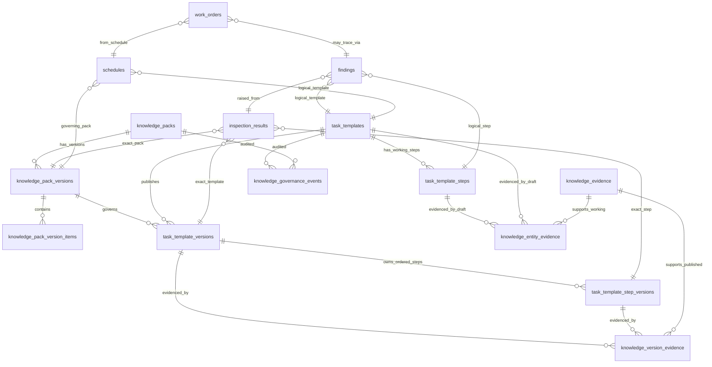

# ATM-013D2 — Atiman Knowledge Governance Design Resolution

Repository: `estrangender26/ODM-CMMS`
Base: `main @ 31c9610`
Date: 2026-08-10
Status: Architecture investigation only — no schema, code, or data changes.

> **Documentation status notice**
> - **Status:** Approved architecture for the implemented core only; remaining sections are deferred proposals.
> - **Authority:** Approved for the core implemented in migrations `009`–`012`:
>   - `knowledge_packs` identity
>   - `knowledge_pack_versions`
>   - `task_template_versions`
>   - `task_template_step_versions`
>   - `task_template_safety_control_versions` (migration `012`)
>   - normalized immutable publication records
>   - template version as the atomic publication boundary
> - **Deferred / not approved for implementation by this task:**
>   - `knowledge_governance_events`
>   - `knowledge_evidence`
>   - `knowledge_entity_evidence`
>   - `knowledge_version_evidence`
>   - any additional AI-governance tables or schema changes not already deployed
> - **Historical base:** `main @ 31c9610`.
> - **Reviewed against:** `main @ 34cae1fad779ff45220fd1783025e6cfc442b44f`.

## Purpose

Resolve four open issues from ATM-013D before DDL:

1. Knowledge Pack identity vs. version
2. Operational traceability without redundant references
3. Provenance during governance (draft/review, not only after publication)
4. Snapshot JSON vs. normalized immutable version records

This document produces the final recommended model for ChatGPT approval.

## Changed Decisions from ATM-013D

| Topic | ATM-013D Decision | ATM-013D2 Decision | Rationale |
|-------|-------------------|--------------------|-----------|
| Pack model | Single `knowledge_packs` table with version string and superseded_by_pack_id | Separate `knowledge_packs` (identity) and `knowledge_pack_versions` (immutable versions) | Stable pack identity; cleaner immutability; easier subscription and rollback |
| Versioning | Snapshot JSON in `knowledge_published_snapshots` | Normalized `task_template_versions` and `task_template_step_versions` | Better referential integrity, queryability, provenance at step level, AI explainability, long-term maintainability |
| Atomic publication | Snapshot of template + steps as JSON | Template version owns its complete ordered step-version set | Clear atomic boundary; historical reproducibility without ambiguity |
| Operational traceability | Snapshot IDs duplicated into inspection_results, findings, schedules | Exact version refs live only in `inspection_results`; findings trace through `inspection_result_id`; schedules hold only logical template + pack version | Avoids redundant versioned references; preserves Finding as primary operational object |
| Provenance governance | Provenance tied only to snapshots | Structured evidence available on working records during draft/review, then frozen with published version | Reviewers need to see evidence before approving |

## 1. Final Knowledge Pack Model

### Tables

```
knowledge_packs
  id (PK)
  pack_code (varchar, unique, stable)       -- e.g., "atiman-shared"
  pack_name (varchar)
  description (text)
  is_active (boolean, default true)
  created_at (timestamp with time zone)
  updated_at (timestamp with time zone)

knowledge_pack_versions
  id (PK)
  knowledge_pack_id (FK → knowledge_packs.id)
  version_number (varchar, semantic)        -- e.g., "1.0.0"
  lifecycle_state (varchar)
    values: draft, under_review, approved, published, superseded, retired
  effective_from (timestamp with time zone)
  effective_until (timestamp with time zone)
  superseded_by_version_id (FK → knowledge_pack_versions.id, nullable)
  author_user_id (FK → users.id, nullable)
  reviewer_user_id (FK → users.id, nullable)
  approver_user_id (FK → users.id, nullable)
  reviewed_at (timestamp with time zone)
  approved_at (timestamp with time zone)
  published_at (timestamp with time zone)
  next_review_at (timestamp with time zone)
  change_summary (text)
  ai_assisted (boolean, default false)
  ai_assistance_detail (jsonb)
  created_at (timestamp with time zone)
  updated_at (timestamp with time zone)
  UNIQUE(knowledge_pack_id, version_number)

knowledge_pack_version_items
  id (PK)
  knowledge_pack_version_id (FK → knowledge_pack_versions.id)
  item_type (varchar, not null)
    values: task_template_version, task_template_step_version,
            equipment_category, equipment_class, equipment_type,
            activity_code, cause_code, damage_code, failure_mode,
            object_part, maintainable_item, subunit,
            safety_control, acceptance_criterion
  item_version_id (int, not null)           -- references the appropriate *_versions table or logical id
  added_at (timestamp with time zone)
  added_by_user_id (FK → users.id, nullable)
  change_type (varchar: added, updated, removed)
  UNIQUE(knowledge_pack_version_id, item_type, item_version_id)
```

### Why separate identity and version tables?

- **Stable identity:** Subscriptions, URLs, and tenant configurations reference `knowledge_packs.pack_code`, not a volatile version row.
- **Immutable versions:** A `knowledge_pack_versions` row, once `published`, never changes except for `effective_until` and `superseded_by_version_id`.
- **Clean supersession:** Each version knows what version replaced it.
- **Rollback safety:** Admins can see exactly what was in v1.2.0 even after v1.3.0 is published.

### Rejected alternative

ATM-013D proposed a single `knowledge_packs` table with `pack_version` as a string column and `superseded_by_pack_id`. Rejected because:
- Pack identity and version history would be mixed.
- Querying “current published version of pack X” requires self-joins.
- Subscription and audit logic become harder.

## 2. Final Versioning Model: Normalized Immutable Versions

### Tables

```
task_template_versions
  id (PK)
  task_template_id (FK → task_templates.id)     -- logical working-record id
  version_number (int, not null)                -- per-template version counter
  equipment_type_id (FK → equipment_types.id)
  industry_id (FK → industries.id, nullable)
  activity_code_id (FK → activity_codes.id, nullable)
  template_code (varchar)
  template_name (varchar, not null)
  maintenance_type (varchar)
  task_scope (varchar)
  description (text)
  frequency_value (int)
  frequency_unit (varchar)
  estimated_duration_minutes (int)
  required_skills (text)
  required_tools (text)
  priority (varchar)
  task_kind (varchar)
  is_system (boolean)
  is_editable (boolean)
  lifecycle_state_at_publish (varchar)
  published_by_user_id (FK → users.id, nullable)
  published_at (timestamp with time zone)
  superseded_by_version_id (FK → task_template_versions.id, nullable)
  knowledge_pack_version_id (FK → knowledge_pack_versions.id, not null)
  change_rationale (text)
  ai_assisted (boolean)
  ai_assistance_detail (jsonb)
  created_at (timestamp with time zone)
  UNIQUE(task_template_id, version_number)

task_template_step_versions
  id (PK)
  task_template_version_id (FK → task_template_versions.id, not null)
  step_no (int, not null)
  task_template_step_id (FK → task_template_steps.id) -- logical step id
  step_type (varchar)
  activity_code_id (FK → activity_codes.id, nullable)
  instruction (text, not null)
  data_type (varchar)
  expected_value (text)
  min_value (numeric)
  max_value (numeric)
  unit (varchar)
  is_required (boolean)
  options (jsonb)
  safety_note (text)
  is_visual_only (boolean)
  requires_equipment_stopped (boolean)
  prohibit_if_running (boolean)
  prohibit_opening_covers (boolean)
  ai_assisted (boolean)
  created_at (timestamp with time zone)
  UNIQUE(task_template_version_id, step_no)
```

### Atomic publication boundary

**A published template version is atomic with its complete ordered step-version set.**

When a template is published:

1. A new `task_template_versions` row is created.
2. One `task_template_step_versions` row is created for every step in the working `task_template_steps` set, all pointing to the new template version.
3. The previous template version is marked `superseded_by_version_id`.
4. Step versions are not independently superseded; they live and die with their template version.

**Why this boundary?**
- It is the smallest unit an operator actually executes: a checklist of ordered steps.
- It prevents partial edits from creating ambiguous historical states.
- It mirrors how physical maintenance procedures are issued and revised.
- It keeps the version graph simple: one chain per template, not two chains (template + steps).

### Snapshot JSON rejected

ATM-013D proposed `knowledge_published_snapshots.snapshot_json`. Rejected because:

| Criterion | Normalized Versions | Snapshot JSON |
|-----------|---------------------|---------------|
| Referential integrity | Strong FKs to version tables | Weak — JSON is opaque |
| Historical reproducibility | Yes | Yes |
| Provenance at step/criterion level | One-to-many FKs from version rows | Buried in JSON |
| Queryability | SQL joins, indexes, aggregations | JSON operators, harder indexes |
| Implementation complexity | Higher initially | Lower initially |
| AI retrieval/explanation | Each step/version is a first-class object | Must parse JSON |
| Long-term maintainability | Better | Worse as JSON schemas drift |

Storage duplication was explicitly excluded as a deciding concern. Normalized versions win on every other criterion.

## 3. Provenance During Governance

### Problem

Evidence must be visible during `draft` and `under_review` so reviewers can approve or reject. It must also be frozen with the published version.

### Solution: evidence records + working associations + frozen version associations

```
knowledge_evidence
  id (PK)
  evidence_type (varchar)
    values: manufacturer_manual, engineering_standard, internal_standard,
            regulatory_source, legacy_migration, engineering_authored,
            ai_assisted_draft, ai_reviewed, operator_feedback, field_evidence
  source_title (varchar)
  issuing_organization (varchar)
  reference_number (varchar)
  edition_or_revision (varchar)
  publication_date (date)
  effective_date (date)
  source_location (text)
  section_or_clause (varchar)
  page_or_paragraph (varchar)
  url (text)
  is_authoritative (boolean)
  created_by_user_id (FK → users.id, nullable)
  created_at (timestamp with time zone)

knowledge_entity_evidence
  id (PK)
  subject_type (varchar)
    values: task_template, task_template_step, equipment_type, equipment_class,
            equipment_category, activity_code, cause_code, damage_code,
            failure_mode, object_part, maintainable_item, subunit
  subject_id (int, not null)
  evidence_id (FK → knowledge_evidence.id)
  derivation_notes (text)
  confidence_level (varchar: established, provisional, experimental, uncertain)
  is_primary (boolean)
  added_by_user_id (FK → users.id, nullable)
  added_at (timestamp with time zone)

knowledge_version_evidence
  id (PK)
  task_template_version_id (FK → task_template_versions.id, nullable)
  task_template_step_version_id (FK → task_template_step_versions.id, nullable)
  evidence_id (FK → knowledge_evidence.id)
  derivation_notes (text)
  confidence_level (varchar)
  is_primary (boolean)
  copied_from_entity_evidence_id (FK → knowledge_entity_evidence.id, nullable)
  added_at (timestamp with time zone)
```

### Governance flow

1. **Draft:** Author attaches `knowledge_entity_evidence` rows to working records. These are editable.
2. **Under Review:** Reviewer sees the working record plus its entity evidence.
3. **Approved / Published:** The publishing process copies the working record into `task_template_versions` + `task_template_step_versions`, and copies `knowledge_entity_evidence` rows into `knowledge_version_evidence` rows tied to the new version IDs.
4. **Historical reproducibility:** `knowledge_version_evidence` is immutable. It records exactly what evidence supported the published version.

### AI-assisted content

- Any working record with AI involvement has `ai_assisted = true` and `ai_assistance_detail` JSON.
- Governance event `ai_assisted_flag_set` is recorded.
- A version cannot be created from an AI-assisted working record unless a governance event of type `approved` exists with a non-null `approver_user_id`.

## 4. Governance Lifecycle and Events

### Lifecycle state machine

Stored on the working record and on pack versions:

```
Draft → Under Review → Approved → Published → Superseded → Retired
```

### Event stream

```
knowledge_governance_events
  id (PK)
  subject_type (varchar)      -- task_template, task_template_step, knowledge_pack, etc.
  subject_id (int)            -- logical id of working record or pack id
  event_type (varchar)
    values: draft_created, submitted_for_review, review_approved, review_rejected,
            approved, published, superseded, retired, ai_assisted_flag_set,
            evidence_added, evidence_removed, change_rationale_updated,
            pack_version_created, pack_version_published
  event_data (jsonb)          -- reviewer/approver IDs, comments, rationale, diffs, version ids
  performed_by_user_id (FK → users.id, nullable)
  performed_at (timestamp with time zone, default now())
```

The event stream is the authoritative audit log. The `lifecycle_state` column is a query cache.

## 5. Operational Traceability Path

### Actual schema execution model

The current schema has two observation paths:

1. **Legacy path:** `schedules` → `work_orders` → `inspection_readings` → `inspection_points` (task_master-based)
2. **Template path:** `inspection_results` → `task_templates` / `task_template_steps`

For Atiman, the canonical observation/result record is `inspection_results` because it is directly tied to task templates and will become the governed-knowledge execution record.

### Canonical traceability

The exact published knowledge reference lives **only** in `inspection_results`:

```
inspection_results
  id
  asset_id (FK → equipment.id)
  task_template_id (FK → task_templates.id)        -- logical, for convenience
  task_template_step_id (FK → task_template_steps.id) -- logical, for convenience
  task_template_version_id (FK → task_template_versions.id)        -- EXACT version
  task_template_step_version_id (FK → task_template_step_versions.id) -- EXACT step version
  knowledge_pack_version_id (FK → knowledge_pack_versions.id)       -- EXACT pack
  recorded_value_number / recorded_value_text / recorded_value_boolean
  unit
  recorded_by_user_id
  recorded_at
```

### Findings

`findings` is Atiman’s primary operational object. It traces back to the exact knowledge through `inspection_result_id`:

```
findings
  id
  inspection_result_id (FK → inspection_results.id, nullable)  -- ADD this
  asset_id (FK → equipment.id)
  task_template_id (FK → task_templates.id, nullable)          -- logical, convenience
  task_template_step_id (FK → task_template_steps.id, nullable) -- logical, convenience
  finding_description
  severity
  recommendation
  status
  reported_by_user_id
  reported_at
```

When a finding is raised from an inspection result, populate `inspection_result_id`. The exact versioned template/step/pack can be found by joining `inspection_results`. **Do not duplicate versioned refs into `findings`.**

If a finding is raised ad-hoc (no inspection), `inspection_result_id` is NULL. This is acceptable; ad-hoc findings are operational observations, not governed executions.

### Schedules

Schedules determine which template to execute and which pack version governs the execution:

```
schedules
  id
  equipment_id (FK → equipment.id)
  task_template_id (FK → task_templates.id, nullable)       -- logical template to execute
  knowledge_pack_version_id (FK → knowledge_pack_versions.id, nullable) -- governing pack version
  ... existing frequency fields ...
```

The actual snapshot/version resolution happens at execution time when the inspection result is created. The schedule does not need versioned template/step refs.

### Work orders

No new traceability columns. Work orders remain operational artifacts that may reference `schedule_id` or `equipment_id`. Traceability to exact knowledge flows:

- work_order → schedule → knowledge_pack_version_id (which pack governed the schedule)
- work_order → inspection_results → exact template/step versions (what was actually executed)
- work_order → findings → inspection_result_id → exact versions

This preserves Work Orders as non-primary operational objects.

### Traceability query example

> “What exact published knowledge governed this finding?”

```sql
SELECT f.id,
       ir.task_template_version_id,
       ir.task_template_step_version_id,
       ir.knowledge_pack_version_id,
       kpv.knowledge_pack_id,
       kpv.version_number
FROM findings f
JOIN inspection_results ir ON ir.id = f.inspection_result_id
JOIN knowledge_pack_versions kpv ON kpv.id = ir.knowledge_pack_version_id
WHERE f.id = ?;
```

> “What evidence supported that exact step version?”

```sql
SELECT ke.*, kve.derivation_notes, kve.confidence_level
FROM task_template_step_versions ttsv
JOIN knowledge_version_evidence kve ON kve.task_template_step_version_id = ttsv.id
JOIN knowledge_evidence ke ON ke.id = kve.evidence_id
WHERE ttsv.id = ?;
```

## 6. Schema Additions Summary

### New tables

1. `knowledge_packs`
2. `knowledge_pack_versions`
3. `knowledge_pack_version_items`
4. `task_template_versions`
5. `task_template_step_versions`
6. `knowledge_evidence`
7. `knowledge_entity_evidence`
8. `knowledge_version_evidence`
9. `knowledge_governance_events`

### Columns added to existing tables

- `task_templates`
  - `lifecycle_state`
  - `published_version_id` (FK → task_template_versions.id)
  - `author_user_id`
  - `submitted_for_review_at`
  - `published_at`
  - `next_review_at`
  - `change_rationale`
  - `ai_assisted`
  - `ai_assistance_detail`

- `task_template_steps`
  - `lifecycle_state`
  - `author_user_id`
  - `change_rationale`
  - `ai_assisted`
  - `ai_assistance_detail`
  - (Step versions are not independently published; their working record only needs lifecycle state and author.)

- `inspection_results`
  - `task_template_version_id` (FK → task_template_versions.id)
  - `task_template_step_version_id` (FK → task_template_step_versions.id)
  - `knowledge_pack_version_id` (FK → knowledge_pack_versions.id)

- `findings`
  - `inspection_result_id` (FK → inspection_results.id)

- `schedules`
  - `task_template_id` (FK → task_templates.id)
  - `knowledge_pack_version_id` (FK → knowledge_pack_versions.id)

### Unchanged tables

- `equipment_categories`, `equipment_classes`, `equipment_types`, `equipment_type_industries`
- `industries`, `activity_codes`, `cause_codes`, `damage_codes`, `failure_modes`, `object_parts`, `maintainable_items`, `subunits`
- `task_master`
- `users`, `organizations`, `facilities`, `equipment`
- `work_orders` (no new refs; trace through schedule/finding)
- `inspection_points`, `inspection_readings` (legacy path; unchanged)

## 7. Migration Strategy for Existing 846 Templates / 3,099 Steps

1. **Create default pack identity:**
   - Insert one row into `knowledge_packs`:
     - `pack_code = 'atiman-shared'`
     - `pack_name = 'Atiman Shared Knowledge Foundation'`

2. **Create default pack version:**
   - Insert one row into `knowledge_pack_versions`:
     - `knowledge_pack_id` = new pack id
     - `version_number = '1.0.0'`
     - `lifecycle_state = 'published'`
     - `published_at = now()`
     - `author_user_id`, `approver_user_id` = 1 (bootstrap admin)

3. **Create template versions:**
   - For each `task_templates` row, insert one `task_template_versions` row with `version_number = 1`.
   - Copy all relevant columns from the working record.

4. **Create step versions:**
   - For each `task_template_steps` row, insert one `task_template_step_versions` row linked to the parent template version.
   - Preserve `step_no` order.

5. **Link pack version to template/step versions:**
   - Insert `knowledge_pack_version_items` for every template version and step version.

6. **Create default evidence:**
   - Insert one `knowledge_evidence` row per template version:
     - `evidence_type = 'legacy_migration'`
     - `source_title = 'ODM-CMMS legacy knowledge bootstrap'`
   - Insert `knowledge_version_evidence` rows linking each template version and its step versions to the evidence record.

7. **Backfill working records:**
   - Update `task_templates`:
     - `lifecycle_state = 'published'`
     - `published_version_id = new version id`
     - `version = 1`
     - `author_user_id = 1`
     - `published_at = now()`

8. **Record governance events:**
   - Insert `knowledge_governance_events` rows:
     - `event_type = 'published'` for each template
     - `event_data` includes pack version and migration rationale

9. **Operational tables:**
   - Leave existing `inspection_results`, `findings`, `schedules` rows untouched. New columns are nullable and will only be populated for new executions.

## 8. Smallest Implementation Sequence

### PR 1 — Core version and governance tables

- Create `knowledge_packs`, `knowledge_pack_versions`, `knowledge_pack_version_items`.
- Create `task_template_versions`, `task_template_step_versions`.
- Add governance columns to `task_templates` and `task_template_steps`.
- Create `knowledge_governance_events`.
- Add migration script to backfill v1.0.0 for existing templates/steps.
- Tests: immutability, version chain, lifecycle transitions.

### PR 2 — Evidence and provenance

- Create `knowledge_evidence`, `knowledge_entity_evidence`, `knowledge_version_evidence`.
- Add default legacy-migration evidence for existing v1.0.0 versions.
- Tests: evidence attach/detach on working records, freeze on publish.

### PR 3 — Operational traceability

- Add version/pack columns to `inspection_results`.
- Add `inspection_result_id` to `findings`.
- Add logical template + pack version columns to `schedules`.
- Update inspection execution code to populate exact version refs.
- Tests: traceability query from finding → inspection → version → evidence.

### PR 4 — Governance rules and AI gating

- Enforce lifecycle rules in application layer.
- Block AI-assisted content from publishing without human approval.
- Add governance event recording on publish/review/approve.
- Tests: AI gating, audit trail completeness.

## 9. Risks and Tradeoffs

| Risk | Mitigation |
|------|------------|
| Normalized versions create many rows | Acceptable; storage is not the deciding concern; queryability and integrity win. |
| Pack version items use polymorphic item_type | Referential integrity is enforced via version tables; item_type documents intent. Future stricter design can add separate tables if needed. |
| Existing operational records lack version refs | Documented; only new records are fully traceable. |
| Step versions cannot be revised independently | This is intentional; step changes require a new template version, ensuring atomic published procedures. |
| Two observation paths (inspection_results vs inspection_readings) | `inspection_results` is the canonical Atiman path; legacy path remains unchanged. |

## 10. Final Model Diagram



## Conclusion

The final recommended model uses:

- **Stable pack identity + immutable pack versions**
- **Normalized immutable template versions and step versions**
- **Template version as the atomic publication boundary**
- **Structured evidence on working records, frozen as version evidence on publish**
- **Canonical traceability through `inspection_results`, with `findings` referencing it**
- **No redundant versioned references in schedules or work orders**

This satisfies all non-negotiable requirements from ATM-013C2 while keeping the implementation as small as a normalized design allows.

STOP for ChatGPT architecture approval.
